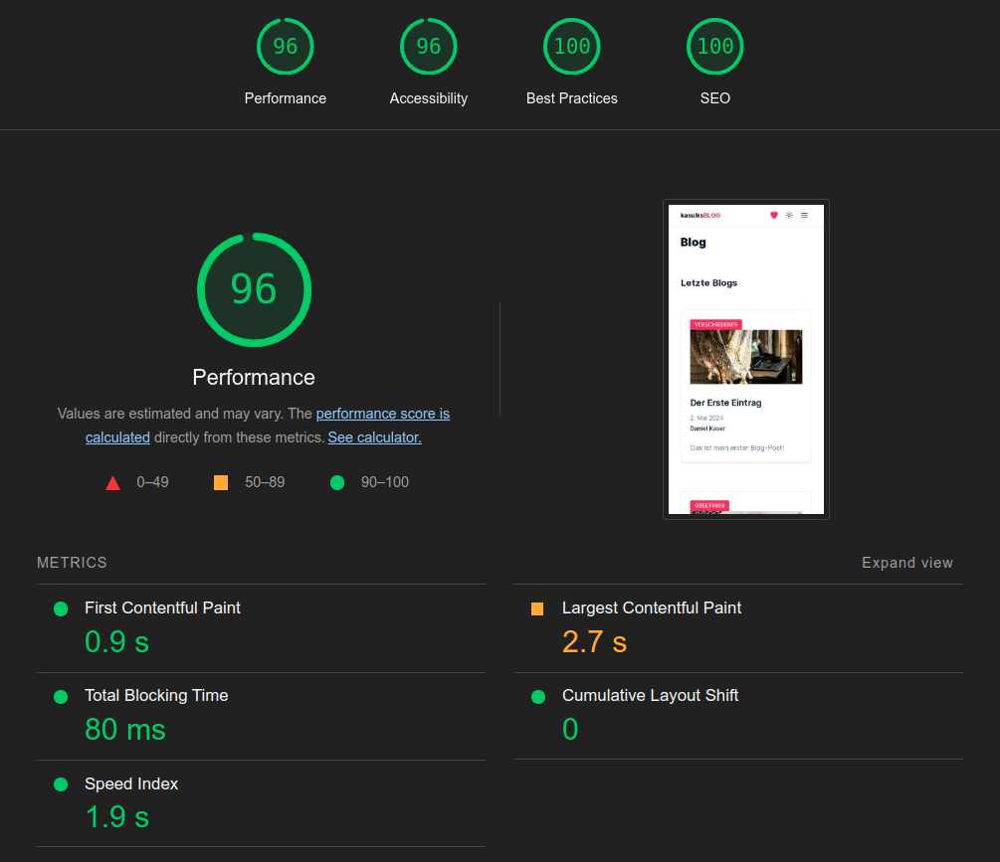

# Blog

This high-performance blog is not made with love. It's made with Next.js 14! It makes use of SSG technology and has a performance score close to 100. (At least every time `I` test it...)

## Tech Stack

JavaScript &bull; TypeScript &bull; React &bull; Next.js &bull; Tailwind &bull; Markdown/MDX &bull; HTML5 &bull; CSS3

## Features

- [x] High performant because of `Next.js` `SSG` technology
- [x] No database needed
- [x] Uses `shadcn` component library
- [x] Inject your `JSX` into `markdown` with `MDX`
- [x] Support Me page to support the author (i.e. me)
- [x] Fetch Codewars' `Rest API` at build time
- [x] Pagination
- [x] Responsive
- [x] Darkmode
- [x] A zillion speling erorrs

## But Why?!

- [x] Because I wanted to deepen my Next.js (14) skills
- [x] Because I wanted to provide a lightning-fast blog to both of my readers
- [x] Because every cool guy needs a blog

## What's next?

- [ ] Lots of, lots of blog posts (actually lots of)
- [ ] Search/filter/sort blog posts by title, author and/or date
- [ ] Contact form
- [ ] FAQ
- [ ] Portfolio page
- [ ] Dynamic table of contents in the sidebar

---

Made with 😋 in Berlin.

